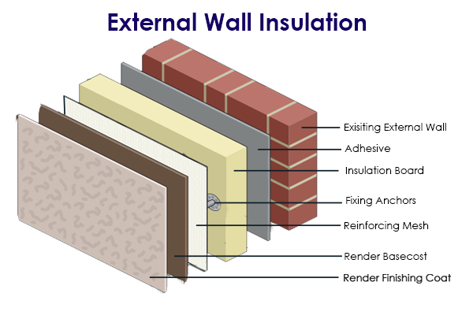

```@meta
EditURL = "../../../examples/src/HeatEquation.jl"
```

# Heat Equation

## A. The Heat Equation in 1D

### 1. The differential equation

The heat equation in one dimension is given by:
```math
\frac{\partial u}{\partial t} - \frac{\partial}{\partial x} \left( \alpha
\frac{\partial u}{\partial x} \right) = f \quad \text{for} \quad x \in (0, L)
\quad \text{and} \quad t > 0
```
where:
- ``x`` is the spatial coordinate,
- ``t`` is the time,
- ``\alpha(x)`` is the spatially-varying thermal diffusivity of the material,
- ``u(x, t)`` is the temperature distribution function,
- ``f(x, t)`` is a time dependent and spatially varying heat source.

### 2. Initial and boundary conditions

To solve the heat equation, we must specify initial and boundary conditions:
1. **Initial Condition**: This refers to the temperature distribution at the initial time
   ``t = 0``. We need to know this temperature distribution in our entire domain
   ``(0, L)``.
   ```math
   u(x, 0) = u_0(x)
   ```
2. **Boundary Conditions**: We can specify different types of boundary conditions, i.e.,
   conditions on the boundaries of our domain, ``x = 0`` and ``x = L``.
   - **Dirichlet Boundary Conditions**: This boundary condition means that the temperature
     is specified at the boundaries of the domain.
     ```math
     u(0, t) = u_0 \quad \text{and} \quad u(L, t) = u_L
     ```
   - **Neumann Boundary Conditions**: This boundary condition means that, instead of the
     temperature, the derivative of the temperature (which is called the heat flux) is
     specified at the boundaries of the domain.
     ```math
     \alpha(0)\frac{\partial u}{\partial x}(0, t) = g_0 \quad \text{and} \quad \alpha(L)
     \frac{\partial u}{\partial x}(L, t) = g_L
     ```

### 3. Applications

A simplified example where the heat equation can be used is to find out how the
temperature is distributed through the outside, insulating walls of your apartment. Look
at the image below
([source](https://www.anglian-building.co.uk/products/external-wall-insulation/)).


The insulation wall is made up of several materials, each with their own thermal
diffusivities $\alpha_i(x)$. Imagine that the temperature outside is 0 degrees, and your
heating system holds the temperature inside your house at 18 degrees. Then, these are the
boundary conditions for the heat equation. Given an initial temperature distribution
through the insulation wall, you could use the heat equation to find out how the
temperature varies inside the insulation wall.

## B. Solving the Heat Equation

### 1. Disadvantages of the above formulation

Now, if we want to compute the solution of the heat equation as stated above, we run into
two difficulties:
1. **Lack of exact solutions**: For a general function ``f``, finding out the exact,
   analytical solution ``u`` is not an easy task. Well, this is not entirely true:
   finding the solution can be easy enough in one dimension on a domain as simple as
   ``(0, L)``, but in higher dimensions and on more complicated geometries (e.g., imagine
   the insulation wall of the
   [Guggenheim museum](https://www.britannica.com/topic/Guggenheim-Museum-Bilbao)) it is
   not possible.
2. **A restrictive set of solutions**: For the above form of the heat equation to make
   sense, we must also assume that the second-derivatives of the solution ``u(x)`` should
   exist, and that the first derivatives of the thermal diffusivity ``\alpha(x)`` should
   exist. It turns out that this is too *strong* of a requirement that it not satisfied
   by many physical systems.

For example, think of the insulation wall - each material in the insulation wall has its
own thermal diffusivity which is completely unrelated to the diffusivities of the other
materials. As a result, ``\alpha(x)`` is a discontinuous function and its first
derivatives do not make sense.

### 2. Tackling the above disadvantages using a discrete & weaker formulation

The above disadvantages are the reason why, in practice, the above *strong* formulation
of the heat equation is not useful. Instead, we formulate a *discrete, weak* version of
the equation which is much more useful in practice. The motivation is:
1. **Discrete approximation of unknown exact solutions**: Since we don't know the exact
   solution in general, we try to approximate it. This is the process called
   discretization. In this process, we fix a finite-dimensional vector space of
   *spatially-varying* functions ``V_n`` and say that, for any given time ``t``, we want
   to find a function ``u_n(\cdot,t) \in V_n`` which approximates the exact solution
   ``u(\cdot,t)``. Here, ``n`` denotes the dimension of the vector space ``V_n``. We
   expect that as ``n \rightarrow \infty``, the solution
   ``u_n(\cdot,t) \rightarrow u(\cdot,t)``.
2. **Weak version of the equation**: Since the original equation imposes too strong
   requirements on the smoothness of ``u(x,t)`` and ``\alpha(x)``, we instead work with
   an integral formulation where only the first derivatives of ``u(x,t)`` should make
   sense, and where ``\alpha(x)`` is allowed to be discontinuous.

> **_ASSUMPTION:_**  For the sake of simplifying the discussion, from now on we will
> assume that we are imposing Dirichlet boundary conditions at ``x = 0`` and ``x = L``.

This discrete, weak version of the problem at a *fixed time* ``t`` is stated as: find
``u_n(\cdot,t) \in S_n`` such that
```math
\int_{0}^{L} w_n\frac{\partial u_n}{\partial t}\;\mathrm{d}x + \int_{0}^{L} \alpha
\frac{\partial u_n}{\partial x}\frac{\partial w_n}{\partial x} \,\mathrm{d}x = \int_0^L
f w_n \, dx\,,\qquad \forall w_n\in W_n\;,
```
where:
* ``S_n := \{v_n(x) \in V_n~:~v_n(0) = u_0\;,\;v_n(L) = u_L\}``,
* ``W_n := \{v_n(x) \in V_n~:~v_n(0) = 0\;,\;v_n(L) = 0\}``.

Note the following important things:
1. The above problem tries to find the solution ``u_n(\cdot,t)`` at the *fixed* time
   instant ``t``.
2. ``S_n`` consists of spatially-varying functions in ``V_n`` that satisfy the boundary
   conditions.
3. We want the integral equation above to be satisfied for all functions ``w_n \in W_n``,
   where the function space ``W_n`` consists of spatially-varying functions in ``V_n``
   that satisfy homogeneous (or, equivalently, zero) boundary conditions.

## C. The finite element method

---

*This page was generated using [Literate.jl](https://github.com/fredrikekre/Literate.jl).*

